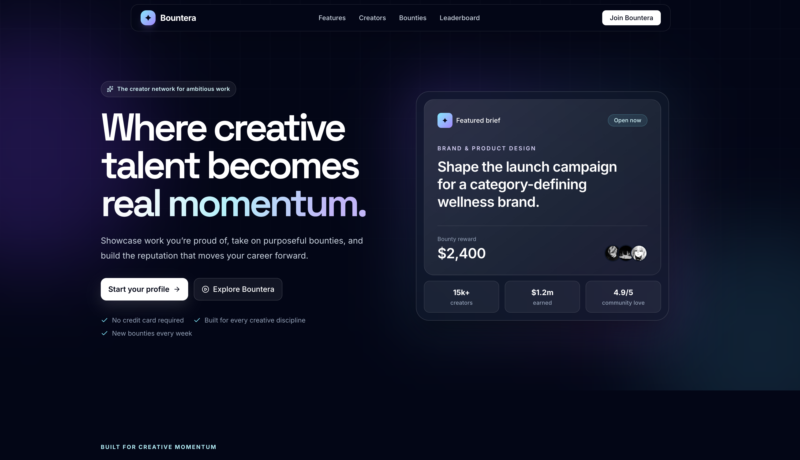
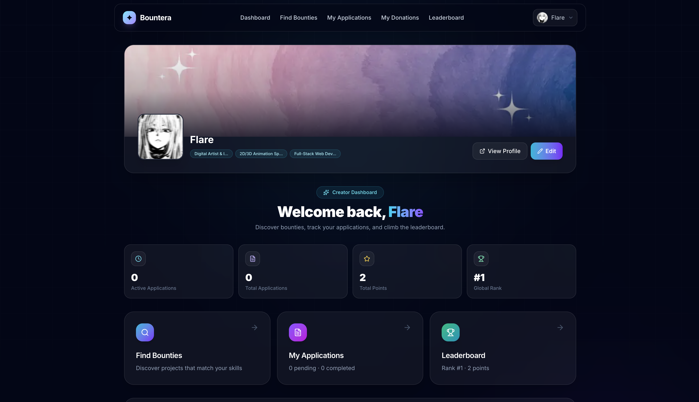
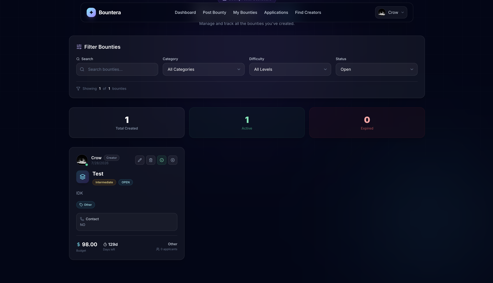

# ⬡ Bountera

<div align="center">


### **A Modern Open-Source Bounty Marketplace**

Create, discover, manage, and complete software bounties through a beautiful role-based platform built with **Next.js**, **NextAuth**, and **Tailwind CSS**.

---



</div>

---

# ✨ Overview

**Bountera** is a full-stack inspired bounty marketplace where developers and organizations collaborate through open-source tasks.

The platform provides two completely separate experiences:

### 🎯 Bounty Posters

Companies, startups and individuals can

- Create bounties
- Manage active bounties
- Track applications
- Review applicants
- Monitor progress
- Complete bounties
- Reward contributors

---

### 👨‍💻 Creators

Developers can

- Discover new bounties
- Apply for opportunities
- Track applications
- Build reputation
- Earn points
- View leaderboard rankings
- Maintain developer profile

---

## 🚀 Features

### 🔐 Authentication

- Secure Login
- NextAuth Authentication
- Session Management
- Protected Routes
- Role Based Access Control

---

### 👥 Dual Role System

- Creator Dashboard
- Bounty Poster Dashboard
- Independent Navigation
- Separate Profile Setup
- Role-based Permissions

---

### 💼 Bounty Management

- Create Bounties
- Edit Existing Bounties
- Delete Bounties
- Search & Filter
- Category Management
- Difficulty Levels
- Expiration Handling
- Status Management
- Active / Completed / Cancelled / Expired States

---

### 📨 Application System

- Apply to Bounties
- View Applications
- Accept Applicants
- Reject Applicants
- Track Application Status

---

### 🏆 Gamification

- Points System
- Activity Tracking
- Leaderboard
- Reputation Growth
- Completion Rewards

---

### 💸 Donations

- Donation History
- Razorpay Integration Ready
- Contribution Tracking

---

### 🎨 Premium UI

- Modern SaaS Design
- Glassmorphism
- Responsive Layout
- Dark Theme
- Gradient Accents
- Smooth Animations
- Mobile Friendly
- Professional Dashboard Experience

---

# 🖼 UI Showcase

## Landing Page

<p align="center">

</p>

---

## Dashboard

<p align="center">

</p>

---

## Manage Bounties

<p align="center">

</p>

---

# 🛠 Tech Stack

| Category | Technology |
|-----------|------------|
| Framework | Next.js 16 |
| Language | JavaScript |
| UI | React 19 |
| Styling | Tailwind CSS |
| Authentication | NextAuth |
| Icons | Lucide React |
| Deployment | Vercel |
| Package Manager | pnpm |
| Storage | Local Storage *(Database Migration Planned)* |

---
# 📂 Project Structure

```text
Bountera
│
├── app/
│   ├── api/
│   ├── applicants/
│   ├── auth-redirect/
│   ├── bounties/
│   ├── bounty-dashboard/
│   ├── bounty-poster-setup/
│   ├── create-bounty/
│   ├── dashboard/
│   ├── leaderboard/
│   ├── login/
│   ├── my-applications/
│   ├── my-bounties/
│   ├── my-donations/
│   ├── profile/
│   └── profile-setup/
│
├── components/
│
├── utils/
│   ├── activityData.js
│   ├── applicationData.js
│   ├── bountyData.js
│   ├── donationData.js
│   ├── pointsSystem.js
│   ├── storageManager.js
│   └── userData.js
│
├── public/
├── img/
├── lib/
├── package.json
└── tailwind.config.js
```

---

# ⚡ Core Modules

### 👤 User Management

- Role Detection
- Session Management
- Profile Storage
- Creator Profile
- Bounty Poster Profile

---

### 💼 Bounty Engine

Responsible for

- Creating Bounties
- Editing
- Deleting
- Filtering
- Expiration
- Status Updates
- Ownership Validation

---

### 📨 Application System

Handles

- Applications
- Accept / Reject
- Status Updates
- Applicant Tracking

---

### 🏆 Points & Leaderboard

Responsible for

- Reward Calculation
- Completion Points
- Leaderboard Ranking
- Reputation Growth

---

### 📊 Activity Feed

Tracks

- New Bounties
- Updates
- Deletions
- Applications
- Completions

---

### 💳 Donation System

Includes

- Donation Tracking
- History
- Razorpay Integration Ready

---

# ⚙ Installation

Clone the repository

```bash
git clone https://github.com/<your-username>/bountera.git
```

Move inside the project

```bash
cd bountera
```

Install dependencies

```bash
pnpm install
```

---

# 🚀 Running Locally

Development

```bash
pnpm dev
```

Production Build

```bash
pnpm build
```

Production Server

```bash
pnpm start
```

Lint

```bash
pnpm lint
```

---

# 🔑 Environment Variables

Create a `.env.local` file.

```env
NEXTAUTH_URL=http://localhost:3000

NEXTAUTH_SECRET=your-secret

GOOGLE_CLIENT_ID=your-client-id

GOOGLE_CLIENT_SECRET=your-client-secret

RAZORPAY_KEY_ID=your-key

RAZORPAY_KEY_SECRET=your-secret
```

---

# 🧠 Application Architecture

```text
                 User
                   │
                   ▼
           Next.js App Router
                   │
         ┌─────────┴─────────┐
         │                   │
         ▼                   ▼
    Authentication       Role Detection
         │                   │
         └─────────┬─────────┘
                   ▼
            Protected Routes
                   │
        ┌──────────┴──────────┐
        │                     │
        ▼                     ▼
 Creator Dashboard    Bounty Dashboard
        │                     │
        └──────────┬──────────┘
                   ▼
             Shared Components
                   │
                   ▼
              Utility Layer
                   │
                   ▼
            Local Storage
        (Database Migration Planned)
```

---

# 📱 Pages

| Route | Description |
|--------|-------------|
| `/` | Landing Page |
| `/login` | Authentication |
| `/dashboard` | Creator Dashboard |
| `/bounty-dashboard` | Poster Dashboard |
| `/bounties` | Browse Bounties |
| `/create-bounty` | Create / Edit Bounty |
| `/my-bounties` | Manage Created Bounties |
| `/my-applications` | Applied Bounties |
| `/leaderboard` | Community Rankings |
| `/profile/[username]` | Public User Profile |
| `/profile-setup` | Creator Profile Setup |
| `/bounty-poster-setup` | Poster Profile Setup |

---

# 🔒 Security Features

- Protected Routes
- Session Validation
- Role-based Authorization
- Ownership Verification
- Secure Navigation
- Access Control
- Client-side Route Guards

---
# ⭐ Highlights

| Feature | Status |
|----------|--------|
| 🔐 Authentication | ✅ |
| 👥 Role Based Access | ✅ |
| 🎯 Creator Dashboard | ✅ |
| 💼 Bounty Poster Dashboard | ✅ |
| 📦 Create Bounty | ✅ |
| ✏️ Edit Bounty | ✅ |
| 🗑 Delete Bounty | ✅ |
| 🔍 Search & Filters | ✅ |
| 📄 Application System | ✅ |
| 🏆 Leaderboard | ✅ |
| 💰 Donations | ✅ |
| 📈 Points System | ✅ |
| 📊 Activity Feed | ✅ |
| 🌙 Modern Dark UI | ✅ |
| 📱 Responsive Design | ✅ |

---

# 🚀 Deployment

The application is optimized for deployment on **Vercel**.

```bash
pnpm install
pnpm build
```

Deploy directly from GitHub for automatic CI/CD.

---

# 🗺 Roadmap

The current version uses **Local Storage** for rapid prototyping. Future releases will migrate to a production-ready backend.

### ✅ Phase 1 — Complete (Current)

- Modern SaaS UI
- Authentication
- Role-based Access
- Creator Dashboard
- Bounty Poster Dashboard
- Bounty Management
- Applications
- Leaderboard
- Donation Tracking
- Responsive Design

---

### 🚧 Phase 2

- PostgreSQL Database
- Prisma ORM
- Persistent User Profiles
- Server-side Data Storage

---

### 🚧 Phase 3

- Real-time Notifications
- Messaging
- Saved Bounties
- Email Notifications

---

### 🚧 Phase 4

- Organization Accounts
- Team Management
- Analytics Dashboard
- Advanced Search
- Public API

---

# 💻 Future Tech Stack

| Layer | Technology |
|--------|------------|
| Frontend | Next.js |
| Styling | Tailwind CSS |
| Authentication | NextAuth |
| Database | PostgreSQL (Neon) |
| ORM | Prisma |
| File Storage | Vercel Blob / Cloudinary |
| Payments | Razorpay |
| Deployment | Vercel |

---

# 🎯 Why Bountera?

Bountera aims to simplify open-source collaboration by connecting developers with meaningful software challenges through a clean, modern, and intuitive platform.

Whether you're an individual developer looking to build your portfolio or a company searching for contributors, Bountera provides a streamlined workflow from bounty creation to successful completion.

---

# 🤝 Contributing

Contributions are always welcome.

1. Fork the repository

2. Create a feature branch

```bash
git checkout -b feature/amazing-feature
```

3. Commit your changes

```bash
git commit -m "Add amazing feature"
```

4. Push to GitHub

```bash
git push origin feature/amazing-feature
```

5. Open a Pull Request

---

# 📜 License

This project is licensed under the **MIT License**.

See the **LICENSE** file for more information.

---

# 👨‍💻 Author

**Ujjwal Sharma**

- GitHub: https://github.com/Flare3416
- LinkedIn: https://linkedin.com/in/ujjwal3416

---

# 🌟 Support

If you found this project useful,

please consider giving it a ⭐ on GitHub.

It helps the project reach more developers and motivates future development.

---

<div align="center">

## Built with ❤️ using Next.js, Tailwind CSS & NextAuth

### ⭐ If you like this project, don't forget to star the repository ⭐

</div>